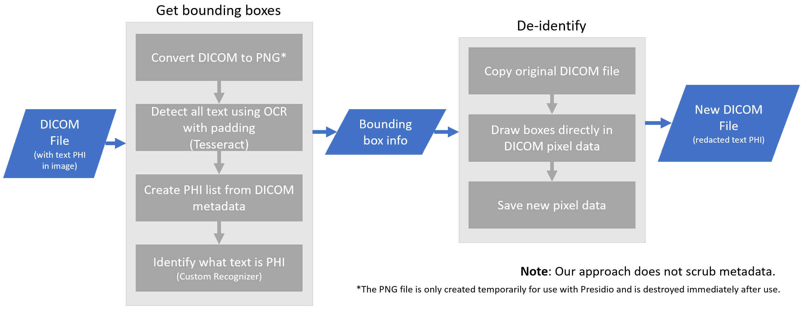

# Presidio DICOM Image Redactor

***Please notice, this class is still in beta and not production ready.***

## Description

The `DicomImageRedactorEngine` class is built to redact text PHI embedded into DICOM images as pixels.



> *Note this module only redacts pixel data and does not scrub text PHI which may exist in the DICOM metadata. We highly recommend using the DICOM image redactor engine to redact text from images BEFORE scrubbing metadata PHI.*

## Installation

Follow the same installation instructions as specified in for the [image redactor engine](../presidio-image-redactor/README.MD).

For best performance, please use the most up-to-date version of Tesseract OCR. We used **v5.2.0.20220712** while developing the `DicomImageRedactorEngine`.

### Side note for Windows

If you are using a Windows machine, you may run into issues if file paths are too long. Unfortunatley, this is not rare when working with DICOM images that are often nested in directories with descriptive names.

To avoid errors where the code may not recognize a path as existing due to the length of the characters in the file path, please [enable long paths on your system](https://learn.microsoft.com/en-us/answers/questions/293227/longpathsenabled.html).

## Getting started

The engine will receive 4 parameters (the last 2 being optional):

1. Path to DICOM image or directory containing DICOM images.
2. Path to the output directory.
3. Padding width to use when running OCR.
4. Redact/masking box color setting.

```python
from PIL import Image
from presidio_image_redactor import DicomImageRedactorEngine

# Set input and output paths
input_path = "presidio-image-redactor/tests/integration/resources/sample.dcm"
output_dir = "./output"

# Initialize the engine
engine = DicomImageRedactorEngine()

# Redact the DICOM image(s)
engine.redact(input_path, output_dir, padding_width=25, box_color_setting="contrast")

# Output is saved to output_dir
```

For an example notebook implementing this code with visual confirmation of the output, see [docs/samples/python/example_dicom_image_redactor.ipynb](../docs/samples/python/example_dicom_image_redactor.ipynb).

## Future Work

* Add compatability with more [photometric interpolations](https://www.dicomobjects.com/kb/Photometric-Interpretations/#:~:text=Photometric%20Interpretations%20DICOM%20allows%20various%20relationships%20between%20the,0028%2C0004%20and%20every%20image%20should%20have%20that%20value.) (currently only supports greyscale and RGB)

* Improve performance for scenarios where no text PHI is available in the DICOM metadata

* Add ability to filter files in a directory based on whether they have text present in the image data or not to enable dynamic selection of which files to process
